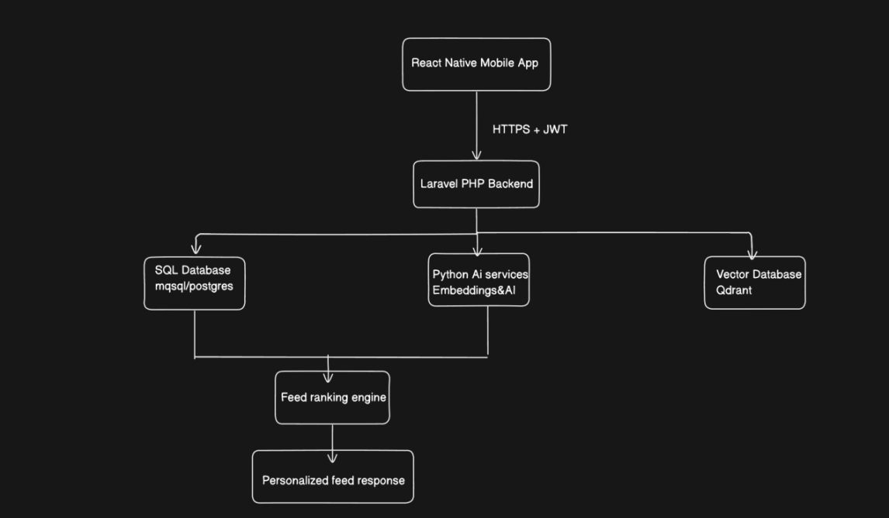

Technical Solution Document (TSD)

# 1. Feature: Real Connections Feed

## Objective

The goal of the Real Connections Feed is to provide users with a personalized social feed that prioritizes meaningful content instead of popularity. Unlike traditional social media platforms where posts are ranked based on likes, shares, or comments, this feed focuses on genuine relationships, authentic content, user interests, and recency.

The feed ranking is based on four main factors:

- Authenticity of the post

- Relationship depth between users

- Semantic similarity using AI embeddings

- Time decay

The application consists of a React Native mobile app, Laravel PHP backend, Python AI service, SQL database, and a Vector Database for semantic search.

# 2. Database Schema Design

## Users

| Column        | Type      |
|---------------|-----------|
| id            | BIGINT    |
| name          | VARCHAR   |
| email         | VARCHAR   |
| profile_image | VARCHAR   |
| created_at    | TIMESTAMP |

Index

- Primary Key (id)

- Email (Unique)

## Posts

| Column             | Type      |
|--------------------|-----------|
| id                 | BIGINT    |
| user_id            | BIGINT    |
| caption            | TEXT      |
| image_url          | VARCHAR   |
| authenticity_score | FLOAT     |
| created_at         | TIMESTAMP |

Indexes

- user_id

- created_at

## User_Interactions

Stores meaningful interactions between users.

| Column           | Type      |
|------------------|-----------|
| id               | BIGINT    |
| user_id          | BIGINT    |
| target_user_id   | BIGINT    |
| interaction_type | VARCHAR   |
| created_at       | TIMESTAMP |

Examples:

- Direct Message

- Reply

- Mention

- Profile Visit

- Conversation

Indexes

- user_id

- target_user_id

## Relationships

| Column             | Type   |
|--------------------|--------|
| user_id            | BIGINT |
| connected_user_id  | BIGINT |
| relationship_score | FLOAT  |

The relationship score increases based on meaningful interactions instead of simply following another user.

## Post_Embeddings

| Column    | Type    |
|-----------|---------|
| post_id   | BIGINT  |
| vector_id | VARCHAR |

The actual embedding vector is stored in the vector database.

## Database Relationships

<table>
<colgroup>
<col style="width: 100%" />
</colgroup>
<tbody>
<tr>
<td>
Users

|

|--- 1 : N ---&gt; Posts

|

|--- 1 : N ---&gt; User_Interactions

|

+--- N : N ---&gt; Relationships

Posts

|

+--- 1 : 1 ---&gt; Post_Embeddings
</td>
</tr>
</tbody>
</table>

# 3. Vector Embeddings

## Why Use Vector Embeddings?

Traditional SQL searches depend on keyword matching. This often fails when users use different words with the same meaning.

Example:

Search:

> *“Funny travel stories”*

A normal keyword search may not return a post saying:

> *“Our hilarious Goa vacation.”*

Even though both have the same meaning.

Embeddings convert text into numerical vectors that represent semantic meaning rather than exact words.

## Embedding Model

I would use OpenAI's text-embedding-3-small model.

### Reasons

- High semantic accuracy

- Fast response time

- Cost-effective

- Easy integration with Python

- Suitable for recommendation systems

## Vector Database

I would use Qdrant.

### Why Qdrant?

- Open source

- Excellent vector similarity search

- REST API support

- Easy integration with Laravel and Python

- Fast performance even with large datasets

- Simple deployment using Docker

## Embedding Workflow

<table>
<colgroup>
<col style="width: 100%" />
</colgroup>
<tbody>
<tr>
<td>
User creates a post

|

v

Laravel stores post

|

v

Python generates embedding

|

v

Embedding stored in Qdrant

|

v

Vector ID stored in SQL
</td>
</tr>
</tbody>
</table>

# 4. API Design

## Authentication

JWT Token Authentication

Example Header

|                                     |
|-------------------------------------|
| Authorization: Bearer \<JWT_TOKEN\> |

## Get Personalized Feed

GET /api/feed

### Response

<table>
<colgroup>
<col style="width: 100%" />
</colgroup>
<tbody>
<tr>
<td>
{

"posts": [

{

"id": 101,

"author": "John",

"caption": "Weekend hiking adventure!",

"score": 0.92

}

]

}
</td>
</tr>
</tbody>
</table>

## Create Post

POST /api/posts

### Request

<table>
<colgroup>
<col style="width: 100%" />
</colgroup>
<tbody>
<tr>
<td>
{

"caption": "Beautiful sunset today",

"image_url": "image.jpg"

}
</td>
</tr>
</tbody>
</table>

## Natural Language Search

POST /api/feed/search

### Request

<table>
<colgroup>
<col style="width: 100%" />
</colgroup>
<tbody>
<tr>
<td>
{

"query": "funny travel stories from last week"

}
</td>
</tr>
</tbody>
</table>

### Response

<table>
<colgroup>
<col style="width: 100%" />
</colgroup>
<tbody>
<tr>
<td>
{

"results": [

{

"id": 45,

"caption": "Our funniest Goa trip",

"similarity": 0.94

}

]

}
</td>
</tr>
</tbody>
</table>

## Record User Interaction

POST /api/interactions

### Request

<table>
<colgroup>
<col style="width: 100%" />
</colgroup>
<tbody>
<tr>
<td>
{

"target_user_id": 20,

"interaction_type": "reply"

}
</td>
</tr>
</tbody>
</table>

# 5. Feed Ranking Algorithm

## Ranking Logic (Plain English)

Each post is assigned a score using four ranking factors.

### 1. Authenticity Score

Posts that appear more genuine receive higher priority.

Examples include:

- Minimal image filters

- Natural-looking photos

- Personal stories

- Honest captions

Overly edited or promotional content receives a lower score.

### 2. Relationship Depth

The system measures how closely two users interact.

Factors include:

- Direct messages

- Replies

- Conversations

- Profile visits

- Frequent interactions

Simply following another user should not significantly increase ranking.

### 3. Semantic Similarity

Every user has an interest profile generated from:

- Previous searches

- Viewed posts

- Liked posts

- Saved content

Each post also has an embedding.

The closer the user's embedding is to the post embedding, the higher the relevance score.

### 4. Time Decay

Recent posts receive a small boost.

However, highly relevant posts should still appear above newer but less relevant posts.

## Final Ranking Formula

<table>
<colgroup>
<col style="width: 100%" />
</colgroup>
<tbody>
<tr>
<td>
Final Score =

40% Relationship Score

+ 30% Semantic Similarity

+ 20% Authenticity Score

+ 10% Time Decay
</td>
</tr>
</tbody>
</table>

## Pseudocode

<table>
<colgroup>
<col style="width: 100%" />
</colgroup>
<tbody>
<tr>
<td>
for each candidate post

relationshipScore = calculateRelationship(user, author)

semanticScore = cosineSimilarity(

userEmbedding,

postEmbedding

)

authenticityScore = calculateAuthenticity(post)

freshnessScore = calculateTimeDecay(post)

finalScore =

relationshipScore * 0.40

+ semanticScore * 0.30

+ authenticityScore * 0.20

+ freshnessScore * 0.10

sort all posts by finalScore

return ranked feed
</td>
</tr>
</tbody>
</table>

# 6. AI Agentic Tools Used

To improve development speed while maintaining code quality, I would use the following AI-assisted tools:

### ChatGPT

- Brainstorming the overall architecture

- Designing the database schema

- Drafting API structures

- Refining the feed ranking logic

- Preparing technical documentation

### GitHub Copilot

- Generating boilerplate Laravel and React Native code

- Creating CRUD operations

- Assisting with repetitive coding tasks

- Writing unit test templates

### Cursor AI

- Understanding unfamiliar code

- Refactoring existing functions

- Suggesting optimizations

- Detecting potential bugs

### Why Use These Tools?

These AI tools help reduce development time by handling repetitive work and providing implementation suggestions. However, every generated solution would still be reviewed, tested, and validated before being merged into production to ensure correctness, security, and maintainability.

# Conclusion

The proposed solution builds a personalized feed that values meaningful relationships over popularity. By combining relationship depth, authenticity signals, semantic understanding through vector embeddings, and time-based relevance, the platform delivers a more genuine and engaging user experience. The architecture is modular, scalable, and designed to support future AI-driven enhancements while maintaining clean separation between the mobile application, backend services, AI processing, and data storage.
